# Архитектура

## Содержание

- [Архитектура](#архитектура)
  - [Содержание](#содержание)
  - [MindMap](#mindmap)
  - [UseCases](#usecases)
    - [Frontend](#frontend)
      - [open-app-usecase](#open-app-usecase)
      - [auth-with-jwt-usecase](#auth-with-jwt-usecase)
      - [auth-with-telegram-usecase](#auth-with-telegram-usecase)
      - [change-profile-settings-usecase](#change-profile-settings-usecase)
      - [add-items-for-buy-usecase](#add-items-for-buy-usecase)
      - [remove-items-for-buy-usecase](#remove-items-for-buy-usecase)
      - [change-items-for-buy-usecase](#change-items-for-buy-usecase)
      - [add-items-for-sell-usecase](#add-items-for-sell-usecase)
      - [remove-items-for-sell-usecase](#remove-items-for-sell-usecase)
      - [change-items-for-sell-usecase](#change-items-for-sell-usecase)
      - [check-items-usecase](#check-items-usecase)
    - [Backend](#backend)
      - [buy-item-usecase](#buy-item-usecase)
      - [sell-item-usecase](#sell-item-usecase)
      - [notify-usecase](#notify-usecase)

## MindMap

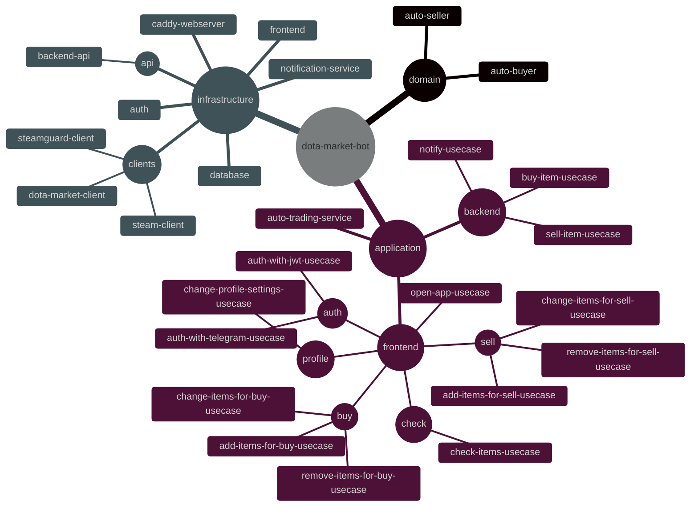

## UseCases

### Frontend

#### open-app-usecase

#### auth-with-jwt-usecase

*Совместно с [open-app-usecase](open-app-usecase)*

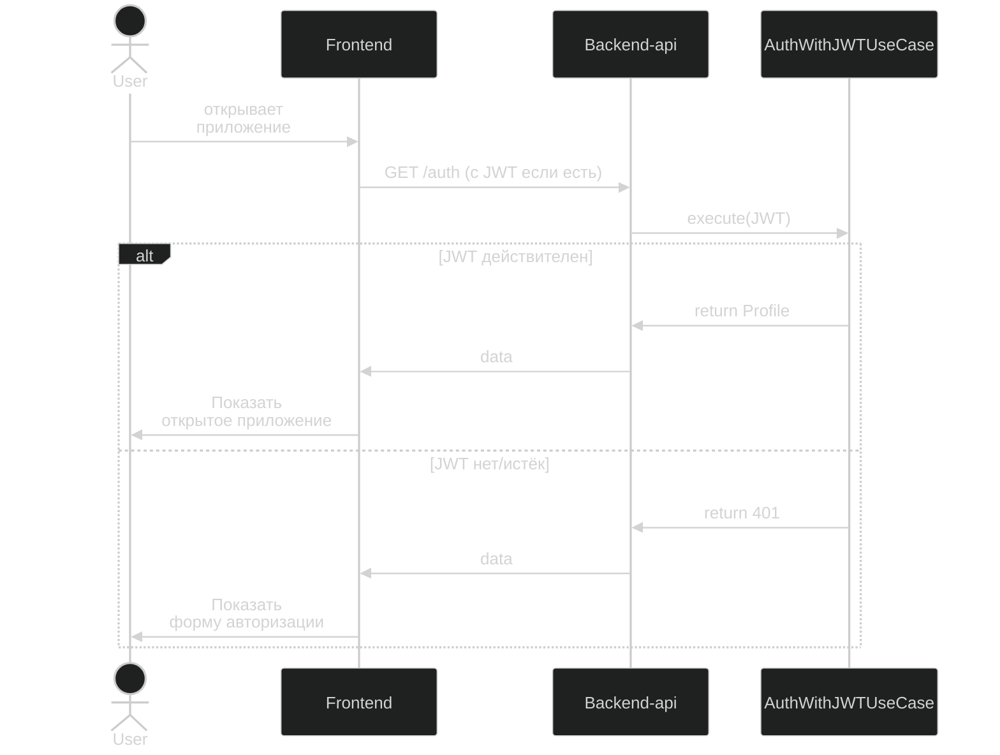

#### auth-with-telegram-usecase

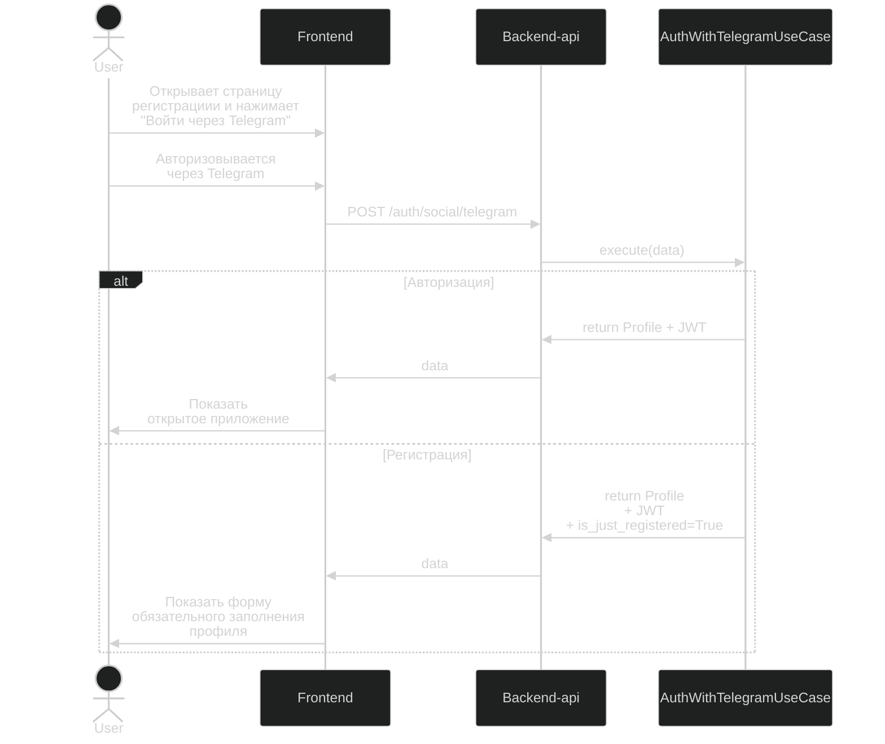

#### change-profile-settings-usecase

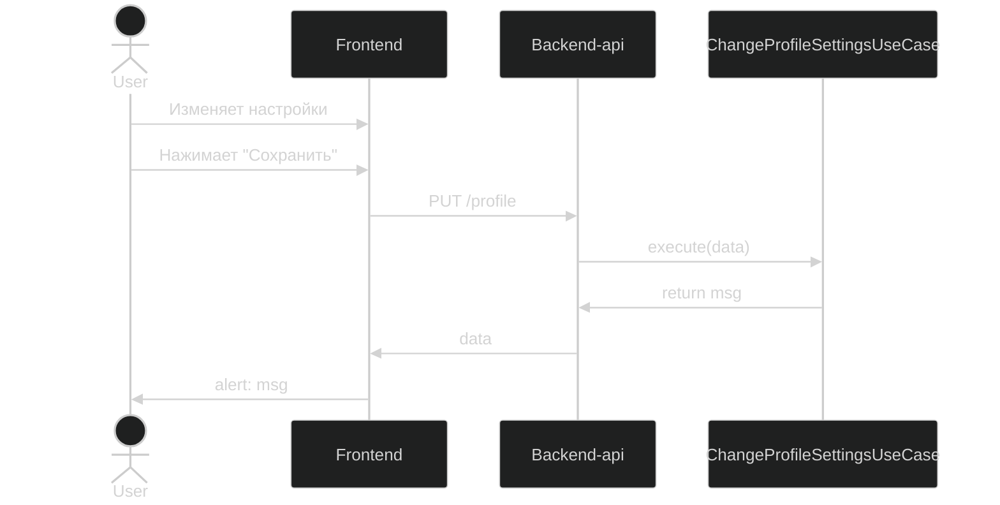

#### add-items-for-buy-usecase

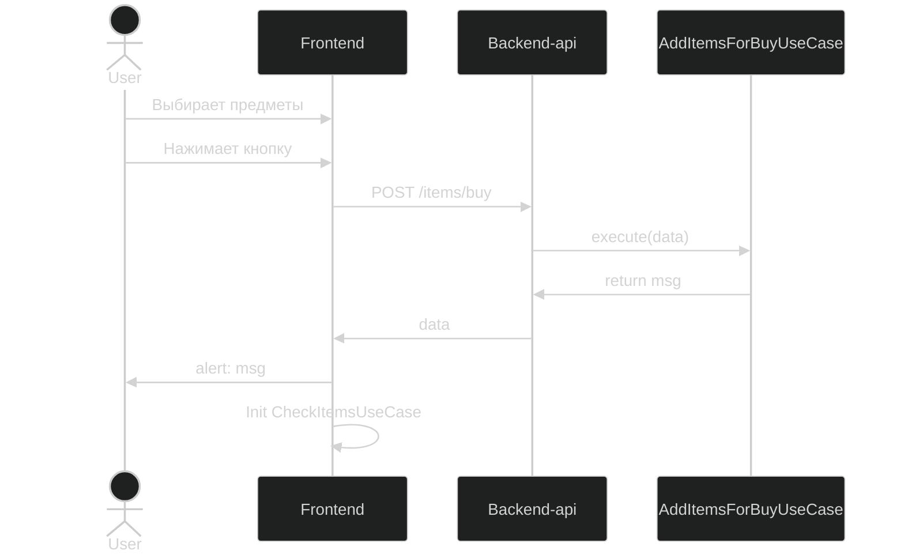

#### remove-items-for-buy-usecase

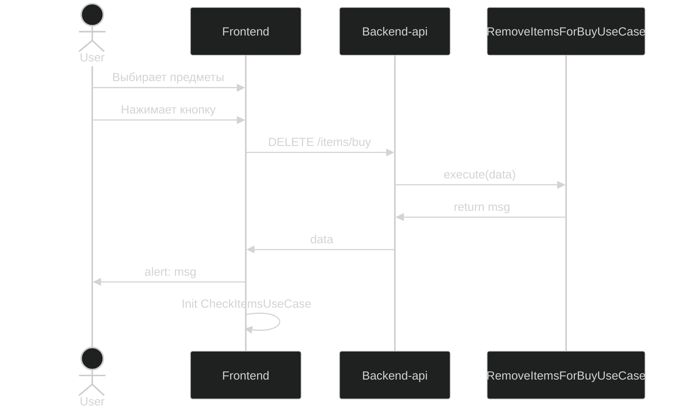

#### change-items-for-buy-usecase

#### add-items-for-sell-usecase

#### remove-items-for-sell-usecase

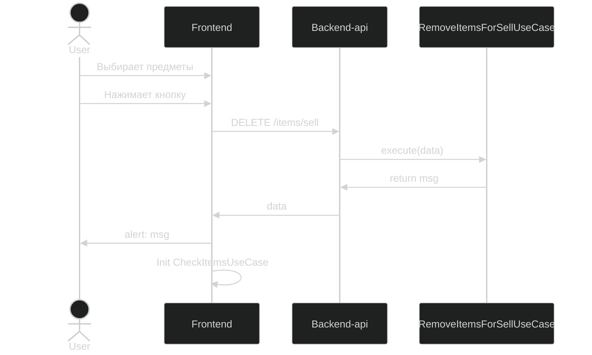

#### change-items-for-sell-usecase

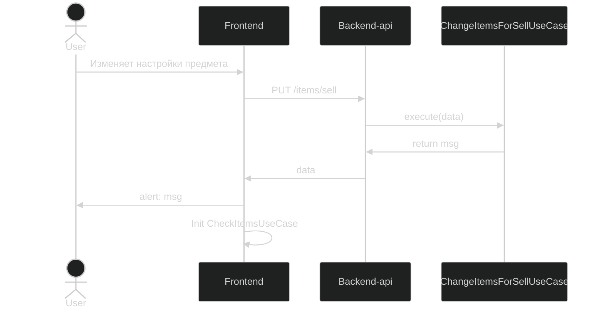

#### check-items-usecase

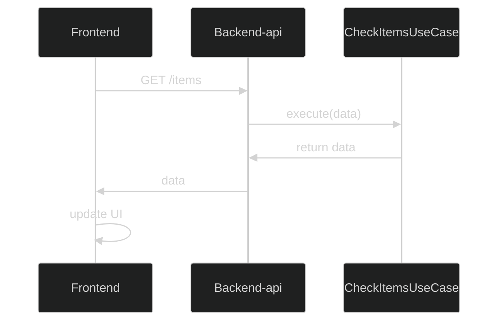

### Backend

#### buy-item-usecase

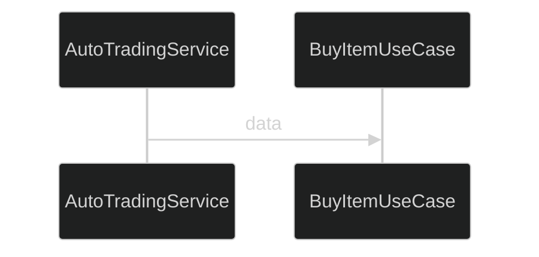

#### sell-item-usecase

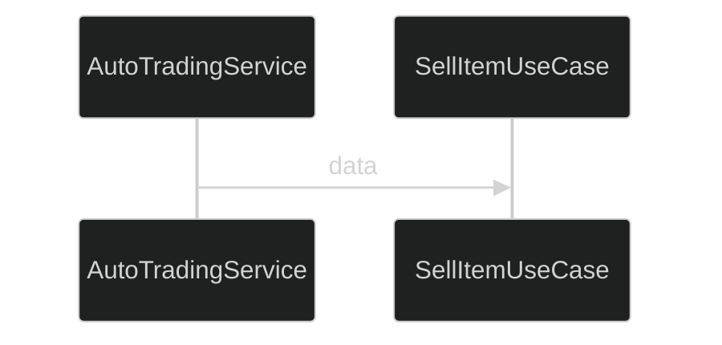

#### notify-usecase

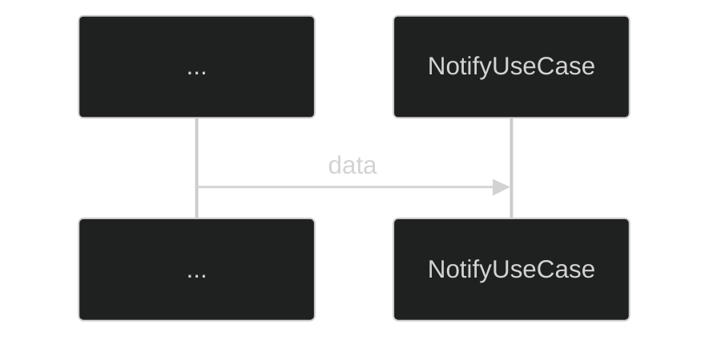
