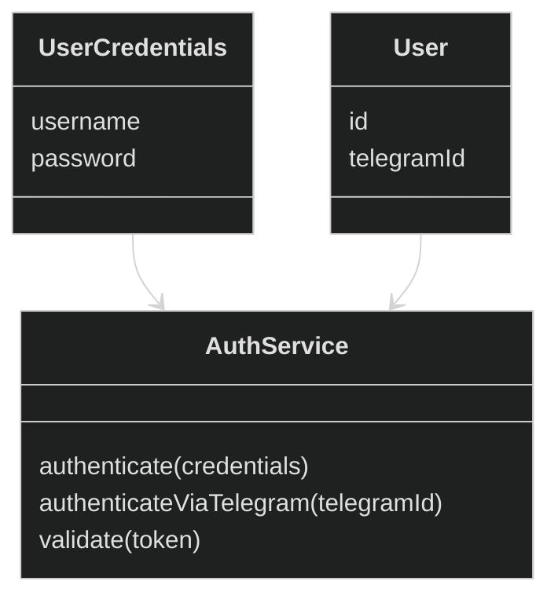

# Auth Context

## Цель

Auth Context отвечает за проверку идентичности пользователя и подтверждение его прав на доступ к системе

## Обязанности

- Авторизация пользователя (username, password) или через email
- Авторизация пользователя через соц-сети
- Управление жизнью JWT-токена
- Гарантия доменных инвариантов

## Не отвечает за

- Торговые операции
- Пользователей и профили
- Уведомления
- Источники данных

## Инварианты

- Аутентификация должна корректно проверять предоставленные данные
- JWT токен не может быть подделан или истекать до заданного времени (в рамках модели)
- Пользователь не может быть авторизован без валидных учетных данных

## Интерфейс пользования

- authenticate(credentials) → AuthResult
- authenticateViaTelegram(telegramId) → AuthResult
- validate(token) → User

## Domain Model

