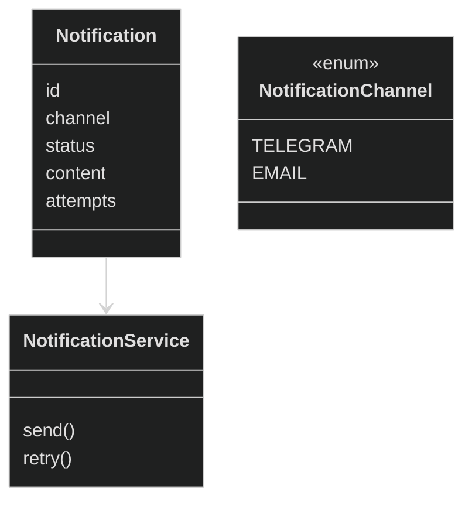

# Notification Context

## Цель

Notification Context отвечает за формирование, попытки доставки и учет состояния уведомлений пользователю.

## Обязанности

- Доставка уведомлений по выбранному каналу
- Гарантия доменных инвариантов

## Не отвечает за

- Пользователей и профили
- Источники данных

## Инварианты

- Notification.status $\in$ {WAIT, SUCCESS, ERROR}
- Notification имеет ровно один канал доставки
- Notification immutable по содержимому после создания
- SUCCESS означает, что канал подтвердил доставку
- ERROR означает, что доставка завершилась неуспешно

## Интерфейс пользования

- send(notification) → Notification
- retry(notificationId) → Notification

## Domain Model

