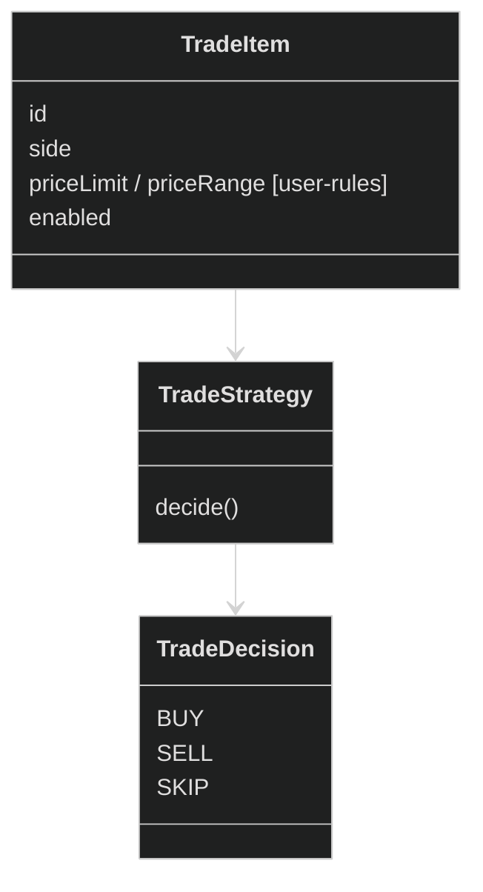

# Trade Context

## Цель

Trade Context отвечает за принятие торговых решений (BUY / SELL / SKIP)
на основе пользовательских ограничений и текущих рыночных данных.

## Обязанности

- Хранение торговых намерений (TradeItem)
- Принятие торгового решения
- Гарантия доменных инвариантов

## Не отвечает за

- Пользователи и профили
- Авторизация
- Уведомления
- Источники данных

## Инварианты

- TradeItem.side $\in$ {BUY, SELL}
- Ограничения обязаны быть учтены
- Если TradeItem disabled то всегда SKIP
- side нельзя менять после создания

## Интерфейс пользования

- decide(tradeItem, marketSnapshot) -> TradeDecision

## Domain Model

