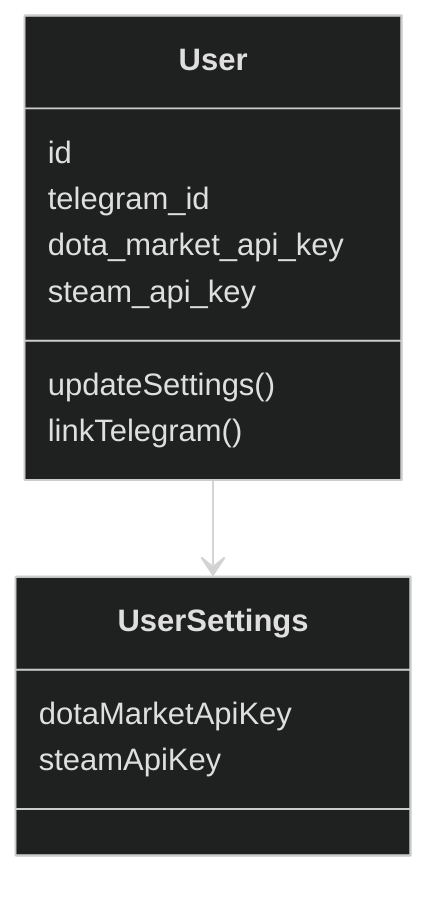

# User Context

## Цель

User Context — это контекст, в котором пользователь выражает свои намерения и ограничения, которые позже будут использованы другими контекстами (Trade, Notification).

## Обязанности

- Хранение пользовательских данных
- Управление пользовательскими настройками
- Гарантия доменных инвариантов

## Не отвечает за

- Принятие решений по торговле
- Авторизация
- Уведомления
- Источники данных

## Инварианты

- User.id неизменяем
- telegram_id уникален
- API-ключ - либо отсутствует, либо валиден по формату

## Интерфейс пользования

- updateApiKeys(dotaMarketKey, steamKey)
- linkTelegram(telegramId)
- updatePreferences(...)

## Domain Model

